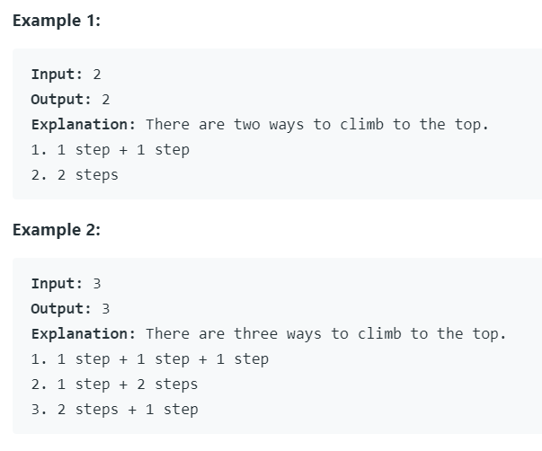

# [Climbing Stairs](https://leetcode.com/problems/climbing-stairs/)

## Description

You are climbing a stair case. It takes n steps to reach to the top.

Each time you can either climb 1 or 2 steps. In how many distinct ways can you climb to the top?

Note: Given n will be a positive integer.

당신은 계단을 오루고 있다. 계단의 정상까지 오를 때 n 스텝을 올라간다.
한 번에 1계단 혹은 2계단 올라갈 수 있다. 정상까지 오르는 데 몇 가지 방법이 있는가?
(양의 정수가 주어진다.)

### Example

## Solution

