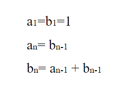

# [Climbing Stairs](https://leetcode.com/problems/climbing-stairs/)

## Description

You are climbing a stair case. It takes n steps to reach to the top.

Each time you can either climb 1 or 2 steps. In how many distinct ways can you climb to the top?

Note: Given n will be a positive integer.

당신은 계단을 오루고 있다. 계단의 정상까지 오를 때 n 스텝을 올라간다.
한 번에 1계단 혹은 2계단 올라갈 수 있다. 정상까지 오르는 데 몇 가지 방법이 있는가?
(양의 정수가 주어진다.)

### Example

## Solution
<pre>
재귀 함수로 작성한 함수도 있지만 Time Limit이 걸려서 다른 방법을 생각해 보았다. 

이해하기 위해 점화식 원리로 생각해 보았다. 

n번 반복을 실행한다.

반복문 안의
a,b=b,a+b 
다음 코드는 아래 점화식의 의미와 같다.
점화식을 다시 한 문자로 정리하면

b(n)=b(n-1)+b(n-2) 이다.

<b> n번째 계단까지 올라가기 전까지 가능한 상태는 한 계단 전에 있던지, 두 계단 전에 있을 수 있다</b>는 의미이다.

</pre>

<pre>

예를 들어, input으로 5가 들어왔을 때 위와 같은 트리를 생각해보면 된다.
우리는 최종적으로 b5를 구하면 되는 것이고 bn을 n까지 가는 경우의 수를 나타낸다고 생각하면 된다.
점화식에 대입해보면 b5는 a4와 b4를 더한 값이고 a4는 b3과 같은 값이다. 
b3은 다시 a2와 b2를 더한 값이고 a2는 b1과 같다.

b1은 1 계단을 올라가는 경우의 수이므로 1이다.
b2는 2 계단을 올라가는 경우의 수이므로 2이다.(혹은 점화식 대입)
3계단을 올라가는 방법 = (1계단을 올라가는 방법 + 2계단을 올라가는 방법)이 되는 것이다.

</pre>

