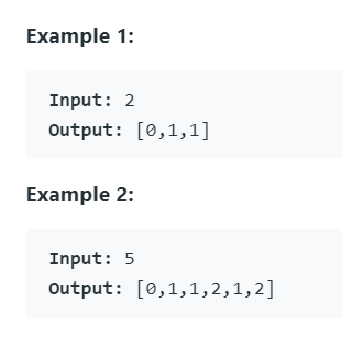
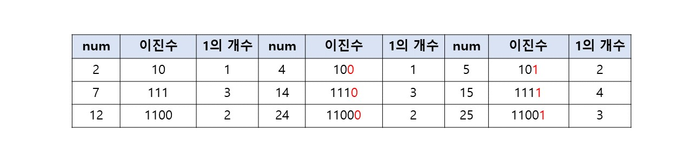
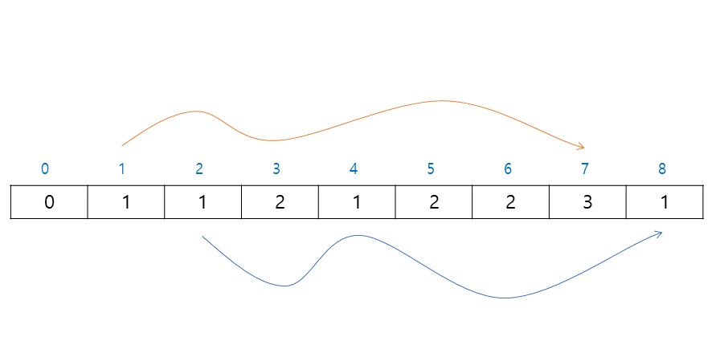

# [Counting Bits](https://leetcode.com/problems/counting-bits/)

## Description

Given a non negative integer number num. For every numbers i in the range 0 ≤ i ≤ num calculate the number of 1's in their binary representation and return them as an array.

음이 아닌 정수가 주어졌을 때, 0에서 n까지의 모든 숫자를 이진수로 변환하였을 때 1의 갯수를 배열로 반환하라.

## Solution

위 규칙에서 보면 2를 두배 하면 4가 되고 최하위비트(LSB)에 0이 붙는다. 5는 2를 두배 하고 1을 더해야하고 1이 붙는다.
마찬가지로 7, 12도 두배 하면 1의 갯수는 그래도이다. LSB에 0이 추가되기 때문이다. 두배+1(홀수)일 경우 1의 갯수가 하나 늘어난다.

<pre>
8을 예로 하면,

0번째는 0이고
1번째는 0의 2배+1 이므로 1
2번째는 나누기 2를 하면 1이므로 1과 같은 갯수 1
3번째는 나누기 2를 하면 몫이 1 나머지 1이므로 1의 갯수에 더하기 1 하면 2
.
.
7번째는 나누기 2를하면 몫이 3 나머지가 1이므로 3의 갯수 2에 더하기 1 하면 1

이런식의 원리로 작성된 코드이다. 

</pre>
