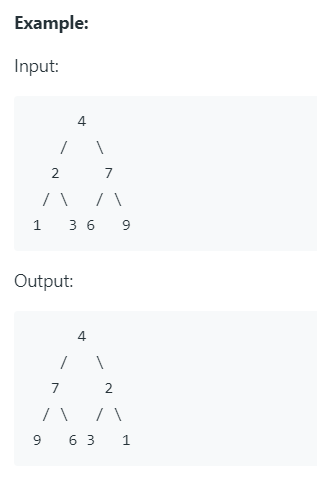

# [Invert Binary Tree](https://leetcode.com/problems/invert-binary-tree/)

## Description

Invert a binary tree.

이진트리를 뒤집어라




## Solution

재귀함수를 사용하면 다음과 같이 간단하게 해결할 수 있다.

  ```
  def invertTree(self, root: TreeNode) -> TreeNode:
        
        # 노드의 끝까지 갔을 때 (배열이 비었을 때)
        if root is None:
            return None
            
        root.left, root.right = \
            self.invertTree(root.right), self.invertTree(root.left)
            
        return root
 ```       
   
   예시를 보면, 
   
   처음 루트는 4이다.
   
   4의 왼쪽 자리 (2가 있는 자리)에는 오른쪽 하단부를 invert 한 것을 넣어준다.
   그러면 7부터 그 아래줄기가 포함된다. 
   
   반면, 4의 오른쪽 자리(2가 있는 자리)에는 왼쪽 하단부를 invert 한 것을 넣어준다.
   그러면 2부터 그 아래 줄기가 해당된다.
   
   이렇게 그 아래줄기가 다시 루트로 들어가 함수가 실행된다.
   
   트리의 리프노드까지 가게 되면, None이 반환되고 재귀함수가 실행되며 트리의 상단부로 올라오며 뒤집혀 간다.
   
   (설명 하기가 어렵다.. ㅎㅎ)
   
  
        
